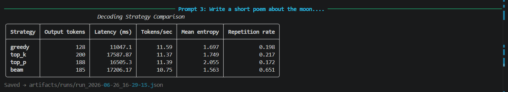
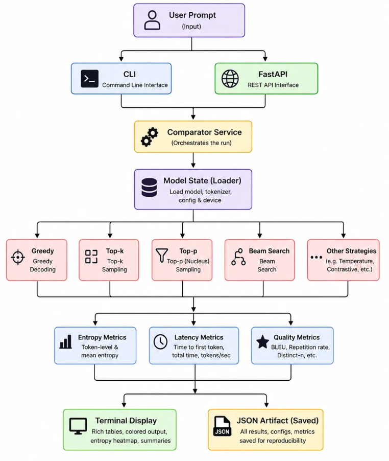

# EntropyLens

```
  ███████╗███╗   ██╗████████╗██████╗  ██████╗ ██████╗ ██╗   ██╗██╗     ███████╗███╗   ██╗███████╗
  ██╔════╝████╗  ██║╚══██╔══╝██╔══██╗██╔═══██╗██╔══██╗╚██╗ ██╔╝██║     ██╔════╝████╗  ██║██╔════╝
  █████╗  ██╔██╗ ██║   ██║   ██████╔╝██║   ██║██████╔╝ ╚████╔╝ ██║     █████╗  ██╔██╗ ██║███████╗
  ██╔══╝  ██║╚██╗██║   ██║   ██╔══██╗██║   ██║██╔═══╝   ╚██╔╝  ██║     ██╔══╝  ██║╚██╗██║╚════██║
  ███████╗██║ ╚████║   ██║   ██║  ██║╚██████╔╝██║        ██║   ███████╗███████╗██║ ╚████║███████║
  ╚══════╝╚═╝  ╚═══╝   ╚═╝   ╚═╝  ╚═╝ ╚═════╝ ╚═╝        ╚═╝   ╚══════╝╚══════╝╚═╝  ╚═══╝╚══════╝

                    per-token entropy visualizer · decoding strategy comparator
```

A terminal-based platform that runs the same prompt through multiple decoding strategies simultaneously and visualizes Shannon entropy from raw logit distributions — per token, per strategy, side by side.

   

---

## Table of Contents

- [Motivation](#motivation)
- [What EntropyLens Is](#what-entropylens-is)
- [Relation to TransformerLens](#relation-to-transformerlens)
- [Related Work](#related-work)
- [Quickstart](#quickstart)
- [Example Output](#example-output)
- [Research Findings](#research-findings)
- [Architecture](#architecture)
- [CLI Reference](#cli-reference)
- [HTTP API](#http-api)
- [Supported Models](#supported-models)
- [Supported Decoding Strategies](#supported-decoding-strategies)
- [Limitations (V1)](#limitations-v1)
- [Running Tests](#running-tests)
- [Repository Structure](#repository-structure)
- [References](#references)
- [Built By](#built-by)
- [License](#license)

---

## Motivation

There is a specific kind of opacity that comes with sampling from a language model. You see the output. You do not see what was discarded to produce it.

When a language model generates a token, it first produces a probability distribution over its entire vocabulary — tens of thousands of candidates, each with an assigned probability. A decoding strategy then collapses that distribution into one token. Greedy picks the mode. Top-p samples from the smallest subset of tokens whose cumulative probability exceeds a threshold. Beam search maintains multiple candidate sequences and selects the globally optimal one.

The distribution itself — the uncertainty the model felt before the decision — is thrown away.

Shannon entropy measures that uncertainty:

```
H(t) = -∑ p(x) log p(x)
```

High entropy at token `t` means the model was genuinely unsure. Many continuations seemed plausible. Low entropy means it committed confidently. EntropyLens makes this visible — per token, across every decoding strategy, simultaneously — so you can see not just what the model said but how uncertain it was when it said it.

This is not a fine-tuned model. It is not a wrapper around another library. It is a structured experimental platform built from first principles: load any HuggingFace causal LM, run it under multiple decoding regimes, collect raw logit distributions, compute entropy, and surface the results in a clean terminal interface with persistent artifact export.

---

## What EntropyLens Is

A fully layered comparison platform. Concretely:

- Run any prompt through greedy, top-k, top-p, and beam search in a single command
- Compute per-token Shannon entropy from raw pre-sampling logit distributions via `output_logits=True`
- Visualize entropy as color-coded terminal bars: green (confident) → yellow → red (uncertain)
- Collect latency, throughput, and repetition rate alongside entropy for each strategy
- Export timestamped JSON artifacts for every run — compare runs, diff strategies across sessions
- Full CLI (`el compare`, `el list`, `el show`, `el diff`) and HTTP API (`/compare`, `/strategies`)
- YAML-driven configuration — swap models, adjust strategies, change inference params without touching code

Supported models out of the box: **Qwen2.5-1.5B-Instruct** and **Phi-3-mini-4k-instruct**. Any HuggingFace `AutoModelForCausalLM` can be added via one line in `config/settings.yaml`.

---

## Relation to TransformerLens

TransformerLens operate on a model's *internals*. They expose attention heads, residual stream activations, and hidden states via hooks and weight captures. They answer: *what circuit produced this behaviour?*

EntropyLens operates one level above that. It observes the *output distribution* — the logit tensor produced at each generation step — and asks: *how uncertain was the model here, and how does the decoding strategy change that?*

No hooks. No model surgery. Works on any HuggingFace model without modification.

The natural research progression:

```
EntropyLens  →  "the model spikes to H=6.38 at token 8 under greedy"
     ↓
TransformerLens  →  "because attention head 4.2 is attending to the wrong token at that position"
```

EntropyLens is the diagnostic layer that surfaces *where* uncertainty concentrates. TransformerLens and NanoLens are the tools to investigate *why*. They are complementary, not competing.

---

## Related Work

EntropyLens is not the first tool to connect entropy and LLM generation. Here is what exists and where EntropyLens sits relative to it.

**Entropy-Lens (Akhmedov et al., 2025 — arXiv:2502.16570)**
The closest name and the closest concept. This is a research paper (not a standalone tool) that uses entropy to analyze *intermediate layer representations* via the logit lens — it tracks how entropy evolves through the residual stream across layers, not across decoding strategies. It builds on TransformerLens and requires hook-level access. EntropyLens by contrast observes the final output logit distribution and requires no internal access — different question, different layer, different scope.

**LM-Polygraph (Fadeeva et al., 2023)**
A production-grade uncertainty estimation framework with 40+ UQ methods, benchmark infrastructure, and a web demo. It measures uncertainty to detect hallucinations and evaluate model reliability on tasks. It does not compare decoding strategies or visualize per-token entropy interactively. It is a research benchmark; EntropyLens is an interactive comparator. LM-Polygraph is the right tool if you want rigorous hallucination detection. EntropyLens is the right tool if you want to understand *how sampling strategy shapes the distribution* on a specific prompt.

**Decoding Uncertainty (Hashimoto et al., EMNLP 2025 Findings)**
The paper closest in research question to EntropyLens — it directly studies how decoding strategies affect uncertainty estimation. It runs experiments on Qwen2.5 and Llama across multiple datasets and decoding strategies. It is a paper with a research codebase, not a usable tool. EntropyLens operationalizes the same question as an interactive local platform: any prompt, any HuggingFace model, results in under 2 minutes.

**GLTR (Gehrmann et al., 2019)**
Visualizes token-level log-probability to detect machine-generated text. Shares the "per-token distribution visualization" idea but is built for text forensics, not decoding comparison. No strategy comparison, no entropy metric, no artifact export.

**AnimatedLLM (2025)**
An educational visualization tool that shows how autoregressive decoding works with animated token selection. Precomputed traces, browser-based, focused on teaching. Not interactive on arbitrary prompts, no entropy measurement, no strategy comparison.

### Where EntropyLens fits

| Tool | Per-token entropy | Decoding strategy comparison | Any local model | Terminal/CLI | Artifact export |
|------|:-:|:-:|:-:|:-:|:-:|
| Entropy-Lens (paper) | ✓ (layer-level) | ✗ | ✗ | ✗ | ✗ |
| LM-Polygraph | ✓ (sequence-level) | Partial | ✓ | ✗ | ✓ |
| Decoding Uncertainty | ✓ | ✓ | ✓ | ✗ | Research only |
| GLTR | ✓ (log-prob) | ✗ | ✗ | ✗ | ✗ |
| AnimatedLLM | ✗ | ✗ | ✗ | ✗ | ✗ |
| **EntropyLens** | **✓ (token-level)** | **✓** | **✓** | **✓** | **✓** |

The gap EntropyLens fills: an interactive, local, CLI-first platform that runs any prompt through multiple decoding strategies simultaneously and surfaces per-token entropy from raw logits in real time. No server required. No precomputed traces. No paper to read first.

The honest caveat: EntropyLens does not implement the rigorous uncertainty estimation methods that LM-Polygraph does (semantic uncertainty, mutual information, conformal prediction). If your goal is hallucination detection or UQ benchmarking, use LM-Polygraph. If your goal is understanding how greedy differs from top-p on *your* prompt on *your* model, EntropyLens is the faster path.

---

## Quickstart

### Prerequisites
- Python 3.10+
- CUDA-capable GPU (tested on RTX 3050 6GB+)
- 4GB+ VRAM for Qwen2.5-1.5B, 5GB+ for Phi-3-mini

### Installation

**1 — Clone the repo**
```bash
git clone https://github.com/AaravJain62677/entropylens
cd entropylens
```

**2 — Create and activate a virtual environment**
```bash
python -m venv venv
venv\Scripts\activate        # Windows
source venv/bin/activate     # Linux/Mac
```

**3 — Install PyTorch with CUDA**
```bash
# CUDA 12.1 (recommended)
pip install torch --index-url https://download.pytorch.org/whl/cu121

# verify GPU is detected
python -c "import torch; print(torch.cuda.is_available())"
# should print: True
```

**4 — Install dependencies**
```bash
pip install -r requirements.txt
```

**5 — Download NLTK data**
```bash
python -c "import nltk; nltk.download('punkt'); nltk.download('punkt_tab')"
```

### Run your first comparison

```bash
python -m cli.main compare -p "Once upon a time in a land far away,"
```

The model (~3GB) downloads automatically on first run from HuggingFace. Subsequent runs load from cache.

### Common commands

```bash
# compare with verbose per-token entropy bars
python -m cli.main compare -p "Your prompt" --verbose

# use a different model
python -m cli.main compare -p "Your prompt" -m phi-3-mini

# run specific strategies only
python -m cli.main compare -p "Your prompt" -s greedy -s top_p

# list saved runs
python -m cli.main list

# inspect a run
python -m cli.main show run_XXXX.json

# start the HTTP API
uvicorn api.app:app --reload
```

### Run tests

```bash
python -m pytest tests/ -v
```

All 13 tests run without a GPU — the comparator tests use mocked models.

### Windows shortcut

To avoid typing the full command every time, create a `run.bat` in the project root:

```bat
@echo off
call "C:\path\to\entropylens\venv\Scripts\activate.bat"
python -m cli.main %*
```

Update the path to match your local setup, then run from PowerShell:

```bash
.\run compare -p "Your prompt"
.\run compare -p "Your prompt" --verbose
.\run list
.\run show run_XXXX.json
```

Note: `run.bat` is gitignored — it's a local convenience file, not part of the repo since paths differ per machine.

---

## Example Output



```
Per-token entropy (■ = high uncertainty)

greedy
  t01 ■■■■■■■■■ 2.32
  t02 ■■■■■ 1.37
  t03 ■ 0.48
  t04 ■■■■■■■■■■■■■■■■■ 4.26   <- genuine branching point, many story directions viable
  t05 ■■■■■■■■■■ 2.68
  t06  0.05                     <- committed, next token nearly certain
  t07 ■■■■ 1.21
  t08 ■■■■■■■■■■■■■■■■■■■■■■■■■ 6.38   <- maximum uncertainty spike

top_k
  t01 ■■■■■■■■■ 2.32
  t02 ■■■■■ 1.37
  t03 ■■■■■■ 1.51               <- diverges from greedy here, sampling explores
  t04 ■■■■■■■■■■■■■■■■■■ 4.58
  t05 ■■■■■■■■■■■■■■■■ 4.03    <- stays in high-entropy region greedy escaped
  ...

Run saved → artifacts/runs/run_2026-06-26_16-07-26.json
```

---

## Research Findings

*Findings are from Qwen2.5-1.5B-Instruct across 5 prompts covering creative, factual, and technical text. Directional and exploratory — not claims about transformers in general.*

### The central finding

**Beam search is confidently repetitive on open-ended generation.**

On the poem prompt ("Write a short poem about the moon"), beam search produced a repetition rate of **0.651** versus top-p's **0.172** — nearly 4× more repetitive — while simultaneously having the *lowest* mean entropy of all four strategies. It was not uncertain. It was wrong in the same way, repeatedly.

This is the classic beam search failure mode on open-ended generation, now measurable with a single command.

### Entropy spikes mark genuine branching points

High entropy in greedy output is not noise. It corresponds to positions where the story, explanation, or argument could legitimately go multiple directions. Token 8 under greedy on the open-ended creative prompt hit **H=6.38** — the model had no confident continuation. Greedy collapsed that uncertainty into one arbitrary choice. Top-k and top-p stayed in that high-entropy region and explored it.

### Prompt type drives mean entropy more than strategy

| Prompt | Greedy H | Top-p H | Beam H |
|--------|----------|---------|--------|
| Poem (creative) | 1.697 | 2.055 | 1.563 |
| Attention mechanisms (technical) | 0.936 | 1.259 | 0.868 |
| Water cycle (constrained) | 0.700 | 0.833 | 0.585 |
| Inflation (factual) | 0.825 | 0.731 | 0.616 |

Creative prompts produce higher mean entropy across *all* strategies than factual ones. The model is more uncertain about how to write a poem than how to explain the water cycle — regardless of whether you sample from it.

### Beam search never truly commits

Beam's entropy bars show large late-sequence spikes (H=6.91, H=7.05 on some prompts) despite being the most deterministic strategy. It forces the model down paths it was not confident about, producing uncertainty spikes in the middle and end of sequences. Greedy commits early and produces smoother entropy curves. Beam optimises globally and pays a per-token uncertainty cost late.

---

## Architecture



EntropyLens follows a strict layered pattern. Business logic lives once in `services/` — the CLI and FastAPI are both thin wrappers over that shared layer. A prompt enters at the top, flows through the comparator which runs each strategy through the inference engine, collects metrics, and surfaces results at the bottom as terminal output and JSON artifacts.

The key technical decision: `runner.py` uses `output_logits=True` in `model.generate()` rather than `output_scores=True`. The difference matters — `output_scores` returns post-filtered distributions after top-k/top-p has already been applied, which artificially compresses entropy for sampling strategies. `output_logits=True` returns truly raw pre-sampling logits, ensuring entropy measurements reflect the model's actual internal distribution.

---

## CLI Reference

```bash
# Compare all 4 strategies on a prompt (default model: qwen-1.5b)
python -m cli.main compare -p "Your prompt here"

# Specify model and subset of strategies
python -m cli.main compare -p "Your prompt" -m phi-3-mini -s greedy -s top_p

# Full per-token entropy bars
python -m cli.main compare -p "Your prompt" --verbose

# List all saved run artifacts
python -m cli.main list

# Inspect a saved run as JSON
python -m cli.main show run_2026-06-26_16-07-26.json

# Diff two runs side by side
python -m cli.main diff -a run_XXXX.json -b run_YYYY.json
```

---

## HTTP API

```bash
uvicorn api.app:app --reload
```

```bash
curl -X POST http://127.0.0.1:8000/compare \
  -H "Content-Type: application/json" \
  -d '{"prompt": "Explain recursion", "strategies": ["greedy", "top_p"]}'
```

Swagger UI at `http://127.0.0.1:8000/docs`.

---

## Supported Models

| Model | HuggingFace ID | VRAM |
|-------|---------------|------|
| Qwen2.5-1.5B-Instruct | `Qwen/Qwen2.5-1.5B-Instruct` | ~3.5GB |
| Phi-3-mini-4k-instruct | `microsoft/Phi-3-mini-4k-instruct` | ~4.5GB |

Any `AutoModelForCausalLM` model can be added via `config/settings.yaml` — no code changes required.

---

## Supported Decoding Strategies

| Strategy | Sampling | Key parameters |
|----------|----------|---------------|
| Greedy | No | Always picks argmax |
| Top-k | Yes | `top_k=50, temperature=1.2` |
| Top-p (nucleus) | Yes | `top_p=0.9, temperature=1.2` |
| Beam search | No | `num_beams=4, early_stopping=True` |

---

## Limitations (V1)

- One active model at a time — no concurrent inference
- Single GPU only, no multi-GPU support
- Entropy computed from `output_logits=True` — reflects the model's raw distribution but instruction-tuned models have already shaped their logit distributions during RLHF, which compresses the entropy range compared to base models
- No browser UI — terminal and HTTP only
- Artifact storage is local filesystem only
- No activation patching — findings are correlational, not causal

---

## Running Tests

```bash
python -m pytest tests/ -v
```

```
tests/test_comparator.py::test_comparator_returns_all_strategies PASSED
tests/test_comparator.py::test_comparator_result_has_required_keys PASSED
tests/test_comparator.py::test_comparator_mean_entropy_is_float PASSED
tests/test_comparator.py::test_comparator_entropies_length_matches_output_tokens PASSED
tests/test_entropy.py::test_uniform_distribution_has_max_entropy PASSED
tests/test_entropy.py::test_deterministic_distribution_has_zero_entropy PASSED
tests/test_entropy.py::test_mean_entropy PASSED
tests/test_strategies.py::test_list_strategies_returns_all_four PASSED
tests/test_strategies.py::test_get_strategy_greedy PASSED
tests/test_strategies.py::test_get_strategy_top_k PASSED
tests/test_strategies.py::test_get_strategy_top_p PASSED
tests/test_strategies.py::test_get_strategy_beam PASSED
tests/test_strategies.py::test_get_strategy_invalid_raises PASSED
13 passed
```

---

## Repository Structure

```
entropylens/
│
├── api/
│   ├── app.py
│   └── schemas.py
│
├── cli/
│   └── main.py
│
├── config/
│   └── settings.yaml
│
├── data/
│   └── prompts.json
│
├── display/
│   └── terminal.py
│
├── docs/
│   ├── demo.png
│   └── architecture.png
│
├── inference/
│   ├── loader.py
│   └── runner.py
│
├── metrics/
│   ├── entropy.py
│   ├── latency.py
│   └── quality.py
│
├── services/
│   ├── comparator.py
│   └── state.py
│
├── strategies/
│   └── registry.py
│
├── tests/
│   ├── test_comparator.py
│   ├── test_entropy.py
│   └── test_strategies.py
│
├── tracking/
│   ├── report.py
│   └── writer.py
│
├── utils/
│   └── loader.py
│
├── .env.example
├── .gitignore
├── LICENSE
├── pyproject.toml
├── pytest.ini
├── README.md
└── requirements.txt
```

---

## References

- Vaswani et al. — [Attention Is All You Need](https://arxiv.org/abs/1706.03762)
- Elhage et al. — [A Mathematical Framework for Transformer Circuits](https://transformer-circuits.pub/2021/framework/index.html)
- Holtzman et al. — [The Curious Case of Neural Text Degeneration](https://arxiv.org/abs/1904.09751)
- Akhmedov et al. — [Entropy-Lens: Uncovering Decision Strategies in LLMs](https://arxiv.org/abs/2502.16570)
- Fadeeva et al. — [LM-Polygraph: Uncertainty Estimation for Language Models](https://arxiv.org/abs/2311.07383)
- Hashimoto et al. — [Decoding Uncertainty: The Impact of Decoding Strategies on Uncertainty Estimation in LLMs](https://arxiv.org/abs/2509.16696)
- Neel Nanda — [TransformerLens](https://github.com/TransformerLensOrg/TransformerLens)

---

## Built By

**Aarav Jain** 
[GitHub](https://github.com/AaravJain62677) · [Blog](https://aaravjain.hashnode.dev)


---

## License

MIT — see [LICENSE](LICENSE) for details.
